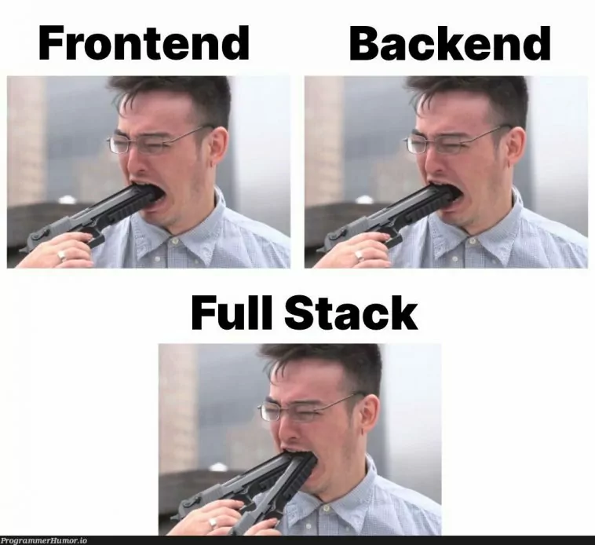
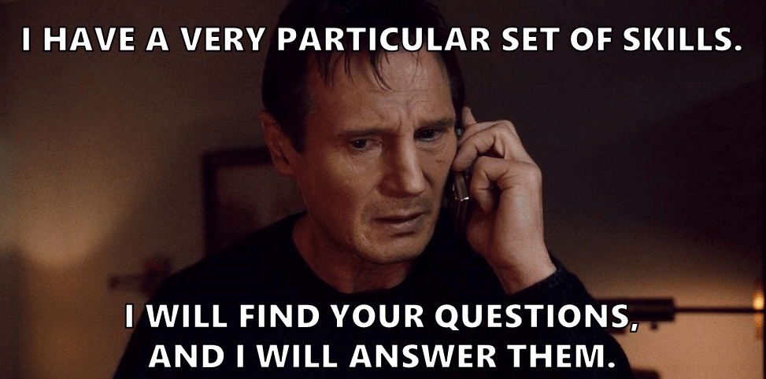

# OpenGuild Community Calls

<pba-flex center>

19/04/2024

</pba-flex>

---

## OpenGuild introduction

Notes:
OpenGuild is an open-source community for Web3 builders interested in the Polkadot ecosystem and Web3 in general. By joining OpenGuild, you will have the opportunity to directly engage with Polkadot development tools, expand your network, and participate in Web3-related events organized by OpenGuild. 🙌 Cheers for your understanding and for being part of this OpenGuild community.

---

## OpenGuild’s mission or agenda  

---

## Day in the Life of a Blockchain Developer

---

## Technical Stack

---

## Working with non-tech client

---

## 

