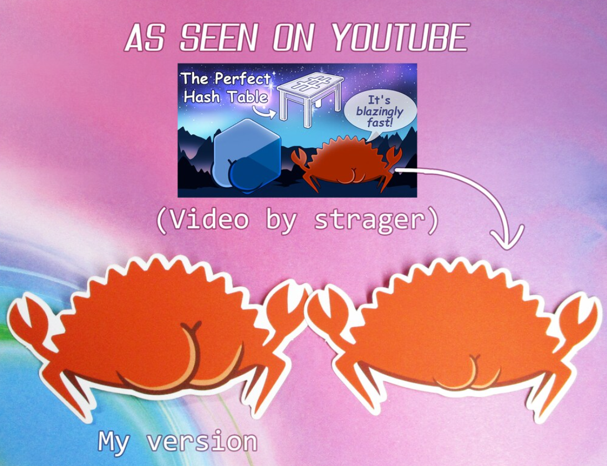

# OpenGuild Community Calls

<pba-flex center>

6/4/2024

</pba-flex>

---

## OpenGuild introduction

Notes:
OpenGuild is an open-source community for Web3 builders interested in the Polkadot ecosystem and Web3 in general. By joining OpenGuild, you will have the opportunity to directly engage with Polkadot development tools, expand your network, and participate in Web3-related events organized by OpenGuild. 🙌 Cheers for your understanding and for being part of this OpenGuild community.

---

## OpenGuild’s mission or agenda  

Notes:

Bọn mình sẽ hỗ trợ xây dựng hình ảnh cho developer tại Việt Nam, giúp mọi người tham gia contribute, hỗ trợ về mặt network.

---

## Weekly news on the Polkadot ecosystem

    Polkadot 
    @Polkadot
    : Opens Speaker Applications for 
    @PolkadotDecoded
    , inviting Web3 innovators to Brussels this July. Share your groundbreaking projects with a global audience and contribute to the Web3 revolution.  https://polkadot.tickets 🗣️🌍

---

    Manta Network 
    @MantaNetwork
    : Unveils Manta AI, a groundbreaking AI toolkit in collaboration with 
    @CelestiaOrg

---

    @OraProtocol
    , and 
    @hyperbolic_labs
     on #MantaPacific. Explore more: https://mantanetwork.medium.com/introducing-manta-ai-full-suite-of-ai-tools-for-training-deployment-and-inference-on-manta-40224cb5d402?postPublishedType=initial 🌊💻

---

    Phala Network 
    @PhalaNetwork
    : Announces a transformative partnership with 
    @FLock_io
     to redefine #DecentralizedAI. This collaboration merges #FLock's model training platform with Phala's confidential computing, setting new AI accessibility and performance standards. Learn about our joint efforts: https://bit.ly/4cL3osk 🤖🔐

---

    Moonbeam Network 
    @MoonbeamNetwork
    : Celebrates the integration of 
    @razor_network
    , a decentralized oracle solution now live on Moonbeam. This enables developers to utilize trustless, real-world price feeds, enhancing DApp functionality and decentralization. Discover the integration: https://medium.com/razor-network/razor-network-is-now-available-on-moonbeam-network-695d8333c7ed 🌐✨

---

    Ajuna Network 
    @AjunaNetwork
    : Advances with BBB ambassador testing, introducing new features like an affiliate system, competition framework, and mobile product. Earn rewards by bringing in new players through the affiliate system. Stay tuned for more updates on how to earn an affiliate code. 🎮🏆

---

    peaq 
    @peaqnetwork
    : Releases the first #DePIN Digest of 2024, showcasing new #DePINs, milestones, and updates within the peaqosystem. Catch up on the latest developments and join the Economy of Things revolution. Read the digest:http://t.co/QslV8nLV9P 🌍🔗

---

    Polytope Labs 
    @PolytopeLabs
    : Advocates for advancements beyond Multi-Sig/Trusted Oracle Bridges, highlighting the necessity for decentralized solutions. Dive into the discussion on why these traditional methods should be avoided for a more secure and efficient future. Full article: https://t.co/tY4E0GOvf7 🌉🛡️

---

    SubQuery 
    @SubQueryNetwork
    : Elevates its platform with the new SDK4.0 release, significantly boosting speed and user experience. We're setting the pace in data indexing with our lightning-fast, enhanced features. Discover the new SDK: https://bit.ly/43MUIgS ⚡📈

---

## OpenGuild's Ranking System

https://handbook.openguild.wtf/general-information/membership/ranking-system

---

## Polkadot Technical Fellowship

https://wiki.polkadot.network/docs/learn-polkadot-technical-fellowship

---

## Rust Quiz

    What is the output of this Rust program?
    
    use std::mem;
    
    fn main() {
        let a;
        let a = a = true;
        print!("{}", mem::size_of_val(&a));
    }
    
    O The program exhibits undefined behavior
    O The program does not compile
    O The program is guaranteed to output: _______

Notes:

- Hint: There are two variables named a. What is the type of each one?
- Answer: O The program does not compile

---

